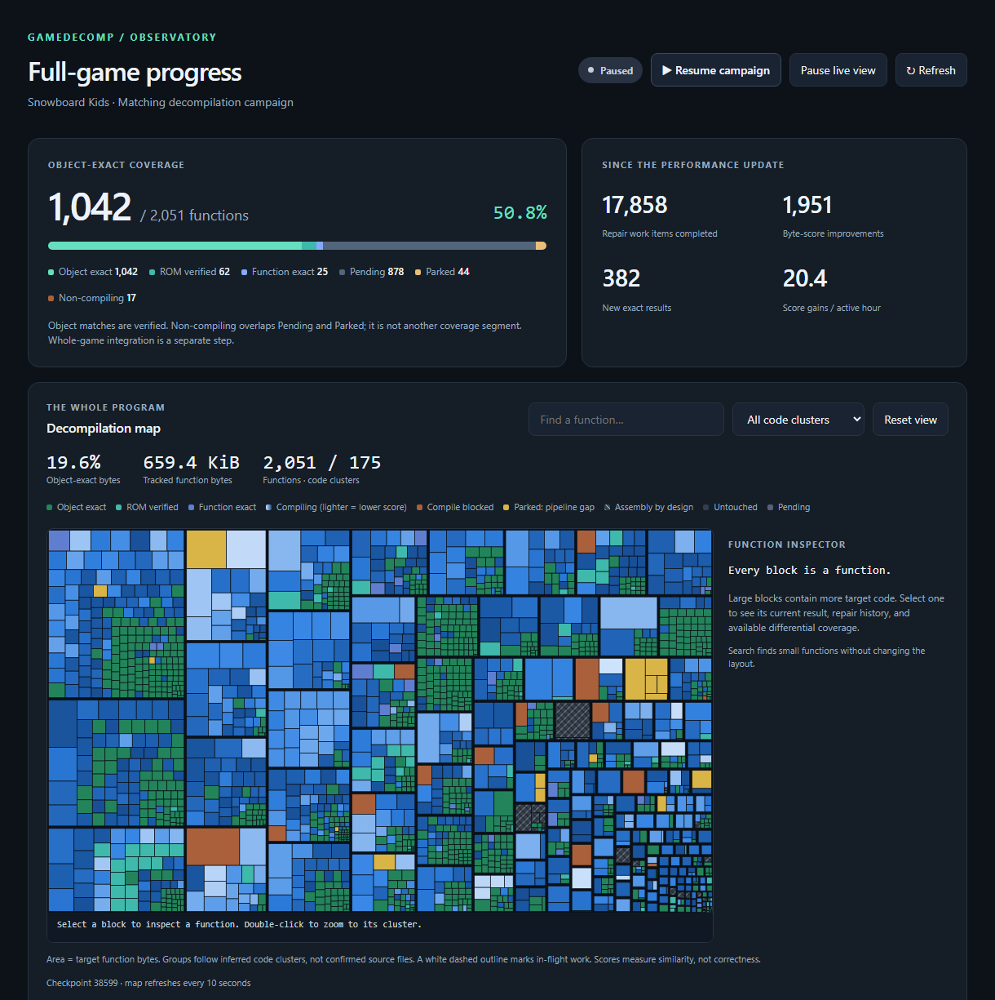

# Progress log

Newest first. Numbers come from the campaign's saved checkpoints or from commit messages. They are not
all the same measurement: the campaign ledger counts functions in the 2,051-function cohort (most of which
began already exact), while `eval.status` counts the smaller research knowledge base. See the
[README](../README.md#current-numbers) before comparing them.

## 2026-10-04 · Campaign checkpoint 38,599

Object-exact or better: **1,104 of 2,051** (53.8%), up from 950 on 2026-09-15. Functions the repair
campaign itself gained: **358**, with 0 lost. Compile-blocked functions: **74 → 14**, and the bytes inside
them 70.2 KiB → 19.2 KiB.

Before, for comparison ([2026-09-15](dashboard-2026-09-15.png)): 909 object-exact, 21 ROM-verified, and
many more orange "compile blocked" blocks in the map.

## 2026-10-03 · Disassembly front end from the ROM alone

Function boundaries for Snowboard Kids come from the ROM without the reference project's symbol files.
For Snowboard Kids 2, which is a GCC build, overlay discovery finds 20 of 20 overlays with ranges and load
addresses exact, and 720 of 720 functions. Emission and a round-trip check (assemble what was disassembled
and compare bytes) are in place. Commits `93abe9c` to `8150101`.

## 2026-09-25 · Operand repair

33 new matches from full-evidence operand repair, plus certificate stages and a rodata owner (`4b74f1c`).

## 2026-09-24 · Binary-derived types

Type contexts derived from the binary (struct layouts and prototypes) plus m2c turned out to be the lever
for a large batch of matches (`07d88b1`). Note that part of the earlier gain depended on the reference
project's headers; the SOLVED tier and the header-assisted tiers are reported separately in `CLAUDE.md`.

## 2026-09-16 to 09-17 · Admission and compile recovery

The cohort loop was limited by what it selected, not by the pipeline; widening it added matches round by
round. The `do`-token ban was removed, which uncovered two matches it had been hiding. Never-attempted
drafts were routed through compile-error recovery, and the placeholder-type pass was wired in. Function-exact
results backed by the ROM became a counted tier. This is the period in which compile-blocked functions
started falling. I have not isolated how much each change contributed.

## 2026-09-15 · Campaign checkpoint 21,492

909 object-exact, 21 ROM-verified, 20 function-exact, 1,059 pending. First README and dashboard screenshot.

## 2026-09-14 · Campaign launches

Register-allocation search, recorded-call replay and the campaign tooling land together (`b309da8`).
Register-allocation search produced 155 of the first 218 functions the campaign gained, with no model call.

## 2026-08-27 to 08-30 · Foundations

Initial harness (08-27). Struct synthesis from the evidence tier, trace-directed repair, instruction-stream
alignment (99.436 → 99.925 on one function), the composition search, and the first deterministic repair
path made the solver's default (08-30). Early hypotheses that failed are kept in
`memory/hypothesis-graveyard.md` so they are not retried.
