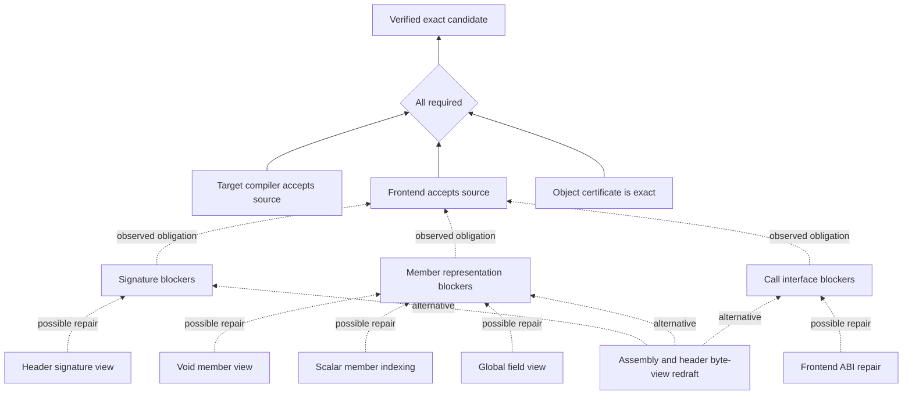

# Repair theory map

The [machinery capability envelope](CAPABILITY_ENVELOPE.md) adds a separate layer
for what existing components should produce under correct implementation and
explicit prerequisites. It distinguishes intended capability from candidate
availability, observed success and whole-function reachability. The map below
describes guarded routes and continuation; the capability layer assesses their
contracts and composition gaps.

The map keeps a repair goal open when one candidate fails, provided a different
guarded approach or changed prerequisites justify another experiment. It records
what each approach was expected to fix and what the compiler actually observed.
It does not assert that an exact C representation exists for every target.

The implementation is an opt-in laboratory planner. The first measured map,
including the useful timer intermediate and current blockers, is
[here](../eval/results/repair-theory-20260922/THEORY_MAP.md).

## Goals, alternatives and evidence

Let the map be `G = (P, R, E_all, E_alt)`: predicates `P`, guarded repair routes
`R`, prerequisite edges that must all hold, and alternative-route edges. For a
concrete source `s` and fixed target/compiler/assistance context `c`:

`Exact(s,c) = Compiles(s,c) AND FrontendAccepted(s,c) AND ObjectExact(s,c)`.

Each route has prerequisites, an existing candidate generator and a predicted
local effect. An alternative edge means "this route may address this blocker";
it does not mean that applying the route proves the predicate. The actual
compiler receipt supplies the next observation.

The three named blocker classes are diagnostic features, not an exhaustive
definition of valid C. Other errors remain visible. Clearing one class can
reveal another; the overall goal remains open until every acceptance check passes.

## What can provoke another attempt

| Observation | Controller response |
|---|---|
| A candidate fails its predicted local effect | Prefer an untried guarded route from that source when available. |
| A blocker clears but the child still fails compilation | Preserve the child and inspect its remaining blockers for a continuation. |
| A different error class appears | Record it explicitly; a lower count in one class is not overall success. |
| Identical source was already observed in this run | Suppress the duplicate. |
| A validated prior world rejected the same source under identical context | Suppress it and cite the prior receipt. |
| Compiler, target, generator or assistance context changes | Prior rejection does not suppress the new experiment. |
| Checker evidence is missing or an infrastructure operation failed | Keep the result inconclusive; do not archive it as a rejection. |
| Current generators emit no untried candidate | Stop as `open-current-routes-exhausted`, with reasons. |
| Compile, depth or proposal-preview limit is reached | Stop at the bound; possibility does not authorize infinite retries. |

Local effects distinguish `prediction-supported`, `partial-support`,
`prediction-not-met` and `unassessed`. These refer only to the stated blocker
classes. They are neither probabilities nor rewards. For example, changing four
member errors into four indexing errors is recorded as a local class reduction
with new blockers; it is not a net improvement.

Selection first uses the existing conditional transition model's predicted exact
mass. Where that provides no preference, theory priority favors ready routes,
cleared root blocker classes and untried approaches. The ordinary depth policy
breaks remaining ties. Experiment cost only bounds the run; it is not a ranking
feature. This priority is a testable heuristic, not a causal regression model.

## Boundaries and use

- [solver/repair_theory.py](../solver/repair_theory.py) derives and validates maps
  from their retained inputs and measures local effects.
- [solver/theory_repairs.py](../solver/theory_repairs.py) invokes six existing
  guarded owners. Every ready route includes an actual changed candidate and
  source/diagnostic/target/assembly bindings. Proposals are not compiler evidence.
- [eval/theory_planner.py](../eval/theory_planner.py) adds retries, partial-parent
  continuation, receipt-bound effects and context-scoped duplicate suppression.
- [eval/repair_planner.py](../eval/repair_planner.py) provides the existing
  `run_planner` and sequence-checked `replay_planner` interfaces.

Construct `TheoryOnline` with the normal source, logged compiler callback,
mutation generator and context, plus an `inspect_routes(source, verdict)` callback
to `solver.theory_repairs.inspect`. Supply validated `prior_worlds` explicitly
when prior failed candidates should be considered. `guide=False` keeps the new
routes and continuation support but disables theory priority for comparisons.

The resulting `theory` record contains maps, effects, route outcomes,
`best_intake_id`, duplicate receipts and the still-open or witnessed goal status.
`best_intake_id` preserves useful noncompiling intermediates separately from the
ordinary compiler-score champion. A map's reconstruction check is not independent
authentication of its input evidence: the planner validates source-bound worlds,
and the experimental audit also binds each receipt to the attempt database.

Failed-parent continuation is allowed only in explicitly marked action histories.
Those histories remain excluded from ordinary counterfactual replay/merging.
No hypothesis can bypass an owner's guards, certify a match, change the KB or
become a confirmed transformation. Production campaign defaults are unchanged.
