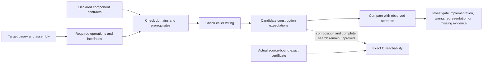

# Capability ceiling of the current machinery

This map separates intended component behavior from observed successes. A correct candidate generator can still produce nonmatching C; a correct checker does not supply a complete synthesis algorithm.

Analyzed 100 existing compiler observations across 30 worlds. New compiler calls: **0**.
Contracts cite hashed owner, test and wiring files in [catalog.json](catalog.json). Full source-bound assessments are linked from [report.json](report.json).

| Function | Exact C witness | Candidate requirements | Remaining composition obligations |
|---|---|---|---|
| `__osDequeueThread` | Receipt 9 | control, exact_object, integer, memory, semantic_equivalence | Concrete exact witness retained |
| `osGetThreadPri` | Receipt 15 | control, exact_object, integer, memory, semantic_equivalence | Concrete exact witness retained |
| `Fvibup` | Receipt 24 | control, exact_object, float, integer, memory, semantic_equivalence | Concrete exact witness retained |
| `Fvibdown` | Receipt 33 | control, exact_object, float, integer, memory, semantic_equivalence | Concrete exact witness retained |
| `Fdistort` | Receipt 42 | control, exact_object, float, integer, memory, semantic_equivalence | Concrete exact witness retained |
| `loadMusicSequenceBank` | Receipt 51 | calls, control, exact_object, integer, memory, semantic_equivalence | Concrete exact witness retained |
| `__MusIntProcessWobble` | Receipt 87 | control, exact_object, integer, memory, semantic_equivalence | Concrete exact witness retained |
| `osSetTimer` | Not yet | calls, control, exact_object, integer, members, memory, semantic_equivalence, signature, wide_calls | complete-candidate-construction, repair-composition, search-completeness, all-input-equivalence, instruction-requirement-coverage |
| `__osInsertTimer` | Not yet | calls, control, exact_object, integer, members, memory, semantic_equivalence, wide_returns | complete-candidate-construction, repair-composition, search-completeness, all-input-equivalence, instruction-requirement-coverage |
| `__osTimerInterrupt` | Not yet | calls, control, exact_object, integer, memory, semantic_equivalence, wide_calls | complete-candidate-construction, repair-composition, search-completeness, all-input-equivalence, instruction-requirement-coverage |

## osSetTimer

[Assessment](worlds/followup--osSetTimer--theory.capability.json); best intake receipt 90.

| Component | Intended output | Applicability | Connected here | Unmet or unknown conditions |
|---|---|---|---|---|
| `cfg` | control-flow-facts | expected-within-contract | Yes | None in this declared contract |
| `dataflow` | access-and-call-facts | expected-within-contract | Yes | None in this declared contract |
| `m2c_draft` | c-candidate | undetermined | Yes | draftable_subset |
| `header_signature` | c-candidate | outside-declared-domain | Yes | signature_shape_supported |
| `void_members` | c-candidate | outside-declared-domain | Yes | void_member_diagnostic, unambiguous_member_access |
| `scalar_members` | c-candidate | undetermined | Yes | indexable_member_base, scalar_member_site_supported |
| `global_fields` | c-candidate | undetermined | Yes | global_member_diagnostic, unambiguous_member_access |
| `frontend_abi` | c-candidate | undetermined | Yes | frontend_idiom_supported |
| `byteview_redraft` | c-candidate | undetermined | Yes | byteview_grammar_supported |
| `type_layouts` | measured-layout-candidates | undetermined | No; compile-recovery, model-repair | type_plan_domain_supported, layout_probe_available |
| `wide_parameters` | c-candidate | outside-declared-domain | No; compile-recovery | single_named_wide_parameter, wide_parameter_typedef |
| `wide_operations` | c-candidate | undetermined | No; compile-recovery | closed_wide_idiom, measured_layouts |
| `call_arity` | c-candidate | undetermined | No; model-repair | word_call_projection |
| `model_edits` | c-candidate | undetermined | No; model-repair | editable_source_slots, model_available |
| `semantic_check` | finite-behavioral-evidence | missing-prerequisite | No; model-repair | compiled_candidate, execution_domain_supported, execution_environment, semantic_evaluator_configured |
| `object_check` | exact-object-decision | missing-prerequisite | Yes | compiled_candidate |

## __osInsertTimer

[Assessment](worlds/followup--__osInsertTimer--theory.capability.json); best intake receipt 94.

| Component | Intended output | Applicability | Connected here | Unmet or unknown conditions |
|---|---|---|---|---|
| `cfg` | control-flow-facts | expected-within-contract | Yes | None in this declared contract |
| `dataflow` | access-and-call-facts | expected-within-contract | Yes | None in this declared contract |
| `m2c_draft` | c-candidate | undetermined | Yes | draftable_subset |
| `void_members` | c-candidate | outside-declared-domain | Yes | void_member_diagnostic, unambiguous_member_access |
| `scalar_members` | c-candidate | outside-declared-domain | Yes | indexable_member_base, scalar_member_site_supported |
| `global_fields` | c-candidate | undetermined | Yes | global_member_diagnostic, unambiguous_member_access |
| `frontend_abi` | c-candidate | undetermined | Yes | frontend_idiom_supported |
| `byteview_redraft` | c-candidate | undetermined | Yes | byteview_grammar_supported |
| `type_layouts` | measured-layout-candidates | undetermined | No; compile-recovery, model-repair | type_plan_domain_supported, layout_probe_available |
| `wide_returns` | c-candidate | undetermined | No; model-repair | closed_wide_return, admitted_callee_evidence |
| `call_arity` | c-candidate | undetermined | No; model-repair | word_call_projection |
| `model_edits` | c-candidate | undetermined | No; model-repair | editable_source_slots, model_available |
| `semantic_check` | finite-behavioral-evidence | missing-prerequisite | No; model-repair | compiled_candidate, execution_domain_supported, execution_environment, semantic_evaluator_configured |
| `object_check` | exact-object-decision | missing-prerequisite | Yes | compiled_candidate |

## __osTimerInterrupt

[Assessment](worlds/followup--__osTimerInterrupt--theory.capability.json); best intake receipt 100.

| Component | Intended output | Applicability | Connected here | Unmet or unknown conditions |
|---|---|---|---|---|
| `cfg` | control-flow-facts | expected-within-contract | Yes | None in this declared contract |
| `dataflow` | access-and-call-facts | expected-within-contract | Yes | None in this declared contract |
| `m2c_draft` | c-candidate | undetermined | Yes | draftable_subset |
| `frontend_abi` | c-candidate | undetermined | Yes | frontend_idiom_supported |
| `byteview_redraft` | c-candidate | undetermined | Yes | byteview_grammar_supported |
| `wide_operations` | c-candidate | outside-declared-domain | No; compile-recovery | named_wide_fields, closed_wide_idiom, measured_layouts |
| `call_arity` | c-candidate | undetermined | No; model-repair | word_call_projection |
| `model_edits` | c-candidate | undetermined | No; model-repair | editable_source_slots, model_available |
| `semantic_check` | finite-behavioral-evidence | missing-prerequisite | No; model-repair | compiled_candidate, execution_domain_supported, execution_environment, semantic_evaluator_configured |
| `object_check` | exact-object-decision | missing-prerequisite | Yes | compiled_candidate |

## Meaning of the ceiling

The current architecture includes candidate constructors and finite search, not a complete inverse compiler. Therefore component coverage alone cannot establish an exact-match percentage achievable under perfect implementation. Known exact candidates are concrete witnesses. Other targets remain open with explicit local expectations and missing composition requirements.

Unlisted mechanisms and unclassified instructions remain unassessed. An unavailable route in this caller does not mean the repository lacks it. All statuses refer to the catalogue's declared domains; they do not assert that a target is globally impossible.

The original binary is an available fallback when its target object is present. Keeping it does not count as C reconstruction. Bounded semantic checks do not prove all-input equivalence. These artifacts remain training-ineligible.
