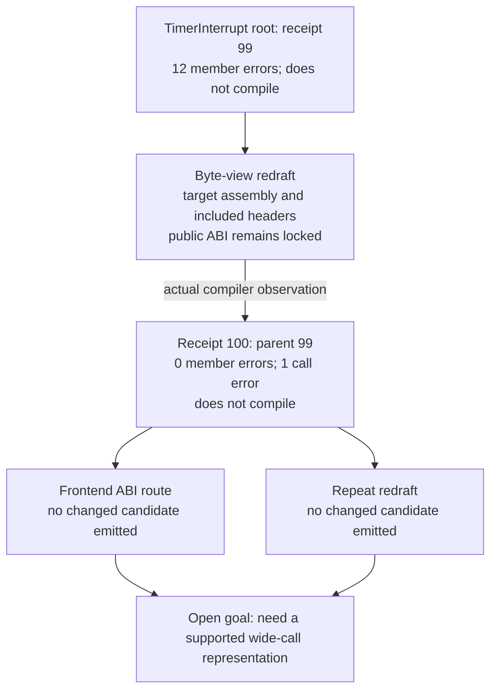

# Measured theory map: timer repairs

The goal remains **open, with current routes exhausted** for all three timer
drafts. This says the available generators have no further distinct candidate
under their present guards. It does not establish that the functions cannot match.

This map is generated from the three-arm frozen comparison on September 22.
[theory-map.json](theory-map.json) retains source-bound maps, route reports,
observations, effects and receipt IDs. [audit.json](paired/audit.json) recomputes
the decisions and checks their durable compiler records.

## The useful partial path

The redraft removed all 12 unknown-member errors and exposed the remaining
`__osSetTimerIntr` call: the generated source passes two word components where
the included declaration expects one `OSTime` argument. The map records local
support for the member repair and a newly observed call blocker. No object match
or semantic correctness follows from this diagnostic improvement.

The planner retains receipt 100 as its best intake candidate and inspects it
again despite its compilation failure. Both current call-related owners decline
to produce a different source. The next actionable requirement is a guarded
wide-call reconstruction that respects the declaration and target calling
convention, followed by the usual compiler and object checks. Merely retrying
receipt 100 would provide no new evidence.

Candidate: [best-intake--__osTimerInterrupt.c](best-intake--__osTimerInterrupt.c).
It is an experimental, noncompiling source, not a production replacement.

## The other observed branches

| Function | Root observation | Tested approach | Result | Present constraint |
|---|---|---|---|---|
| `osSetTimer` | 1 signature, 6 member, 1 call error | No owner emitted a candidate | Root retained, receipt 90 | Signature owner cannot reconcile the supported parameter widths; redraft cannot pass the public ABI guard. |
| `__osInsertTimer` | 18 member errors, receipt 94 | Scalar member indexing, receipt 95 | 14 member + 4 indexing errors; still 18 total | Scalar storage is not an array; record representation also remains unresolved. Root retained. |
| `__osTimerInterrupt` | 12 member errors, receipt 99 | Assembly/header byte-view redraft, receipt 100 | 1 call error | A supported representation for the split wide argument is missing. Child retained. |

The InsertTimer route has the narrow label `partial-support` because the member
error count fell. Its `new_blockers` contains `other`, and there is no reduction
in the total error count. Treat this as an unsuccessful representation change,
not a capability gain or a training success. The independent intake arm observes
the same transition at receipts 92 to 93; TimerInterrupt repeats at 97 to 98.

For InsertTimer the redraft ABI guard also reports `OSTime` versus `u64` spelling
at the public return boundary. That is an explicit compatibility question to
resolve using header/type and compiler evidence before relaxing the guard. It is
not evidence that either spelling may be substituted without checking.

## What the map says to develop next

These are requirements exposed by the observed failures, not executable routes
or proven solutions:

1. A wide-call representation for the retained TimerInterrupt candidate that
   preserves the declared interface and the target's word order and register use.
2. For InsertTimer, establish storage extent before converting scalar pseudo-
   members to indexing; determine a compatible public return representation.
3. For SetTimer, reconcile split wide parameters with the public declaration
   before composing member and call repairs.

Each new mechanism needs a motivating positive guard test and a frozen compiler
comparison. A theoretically plausible route becomes executable only when its
generator has the required evidence. Existing target assembly and headers are
the evidence sources; reference implementation bodies remain excluded.

## Limits of this experiment

All three timer drafts were previously exposed and use project headers. This is
a revisit for repair coverage, not fresh transfer. Five names in the declared
eight-name follow-up panel lack existing target workspaces and were not tested:
`osSetIntMask`, `osGetCount`, `osGetCompare`, `__osGetCause`, `osStopTimer`.

The route-only and theory-prioritized arms chose identical source sequences on
all ten measured cases. The useful intermediate is attributable to the added
route/failed-parent support; this experiment does not show that theory priority
improves selection. Alternate-after-negative and multi-stage failed-parent
continuation are also exercised in deterministic unit tests, not demonstrated
as new exact timer matches here. Full accounting: [RESULT.md](RESULT.md).
